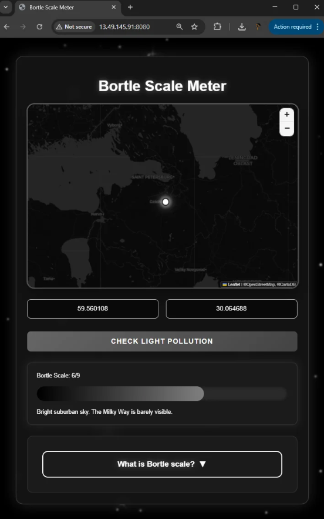

# Bortle Scale Meter

An interactive tool designed for astronomers and stargazers to measure light pollution levels anywhere on Earth. By processing real spatial data, the service determines celestial object visibility according to the 9-level Bortle scale. 

### Core Features
 

**• Global Coverage**  
Instantly determines light pollution levels for any geographical coordinate on Earth.

 

**• Bortle Scale Integration**  
Automatically translates raw radiance data into the standard 9-level Bortle Dark-Sky Scale.

 

**• Responsive Design**  
Mobile-first interface optimized for seamless use on any device.

 
 

---

### Deployment & Status

>   **Hosting Status:** The public AWS EC2 production instance (`http://13.49.145.91:8080`) is currently offline as the active hosting period has concluded. 

To test the application, you can easily deploy it locally:
1. Clone this repository to your machine.
2. Run the application in your local environment (**localhost** configuration is fully unlocked for demonstration purposes).

*Created by P.A. Galochkin (@pentalux). All rights reserved.*
